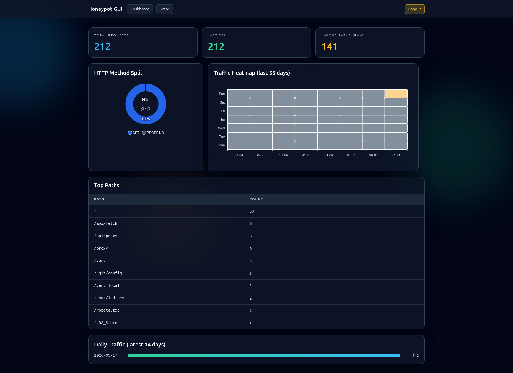
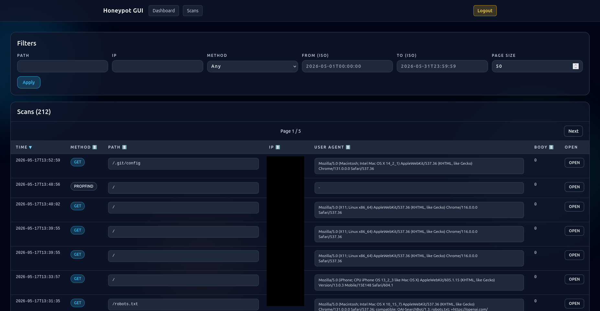
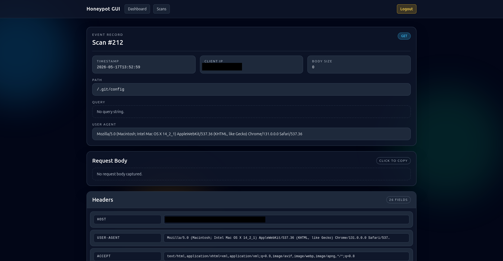

# VPS Honeypot Scanner Logger

Docker Compose setup for a scanner-attracting HTTP service exposed on a VPS IP address.

## What this stack does

- Exposes honeypot HTTP listener on host port `80` by default.
- Logs every inbound HTTP request path into SQLite.
- Rolls up and prunes raw scan records older than 7 days while keeping daily/method totals for dashboards.
- Exposes a GUI with login-protected browsing.
- Supports GUI-managed webhooks with interval triggers, optional scan field filters, and templated JSON payload delivery.

## Images

### Frontpage



### Scans



### Scan




## Services

- `honeypot`: FastAPI app listening on container port `8000`, mapped to host `80`.
- `honeypot-gui`: FastAPI app listening on container port `8001`.

## Quick start

1. Copy env template:

```bash
cp .env.example .env
```

2. Configure GUI credentials and session secret in `.env`.

3. Build and run:

```bash
docker compose up --build -d
```

4. Generate sample traffic:

```bash
curl -s http://127.0.0.1/admin
curl -s "http://127.0.0.1/wp-login.php?x=1"
curl -s -X POST http://127.0.0.1/api -d '{"a":1}' -H 'content-type: application/json'
```

5. View logs:

```bash
docker compose logs -f honeypot
```

## Environment variables

In `.env`:

- `HONEYPOT_HOST_PORT`: Host-exposed port, default `80`.
- `TZ`: Timezone for schedule behavior, default `UTC`.
- `RETENTION_DAYS`: Days to keep full raw scan rows, default `7`.
- `RETENTION_SCHEDULE_HOUR`: Daily retention job hour, default `0`.
- `RETENTION_SCHEDULE_MINUTE`: Daily retention job minute, default `30`.
- `GUI_ADMIN_USERNAME`: Login username for GUI.
- `GUI_ADMIN_PASSWORD_BCRYPT`: Bcrypt hash of GUI password.
- `GUI_SESSION_SECRET`: Long random secret for session cookies.

In compose environment for honeypot:

- `HONEYPOT_DB_PATH`: SQLite path inside container (`/data/honeypot.db`).
- `RETENTION_DAYS`: Full-detail row retention period in days (default `7`).
- `RETENTION_SCHEDULE_HOUR`: Daily rollup/prune job hour (default `0`).
- `RETENTION_SCHEDULE_MINUTE`: Daily rollup/prune job minute (default `30`).

In compose environment for `honeypot-gui`:

- `HONEYPOT_DB_PATH`: SQLite path (`/data/honeypot.db`) shared from honeypot volume, mounted read-only.
- `GUI_DB_PATH`: Writable SQLite path used by the GUI for local settings and webhook definitions.
- `GUI_ADMIN_USERNAME`: Admin username used by login form.
- `GUI_ADMIN_PASSWORD_BCRYPT`: Bcrypt password hash used for authentication.
- `GUI_SESSION_SECRET`: Cookie signing secret.

## Webhooks

- Configure webhooks in the GUI under the `Settings` page.
- Customize dashboard HTTP method pie-chart colors under `Settings` to fit your traffic profile.
- Trigger behavior: every `X` seconds per webhook.
- Optional filtering: match a scan field exactly (for example `method = POST` or `path = /admin`).
- Payload is rendered from a JSON template with these variables:
	- `scan.id`, `scan.ts`, `scan.method`, `scan.path`, `scan.query_string`, `scan.url`, `scan.client_ip`, `scan.user_agent`, `scan.body_size`, `scan.body_text`
	- `webhook.id`, `webhook.name`, `now`
- Use `| tojson` for dynamic values in templates to keep output JSON valid.

Generate the GUI bcrypt hash:

```bash
python3 -c "import bcrypt; print(bcrypt.hashpw(b'your-strong-password', bcrypt.gensalt()).decode())"
```

## Notes for VPS deployment on raw IP

- Keep DNS off if you want direct IP scanning behavior.
- Open only the chosen external port in VPS firewall (`80` by default).
- Persisted request database is stored in `./data/honeypot.db`.

## Manual DB inspect example

```bash
sqlite3 data/honeypot.db 'select ts, method, path, client_ip from scans order by id desc limit 20;'
```
